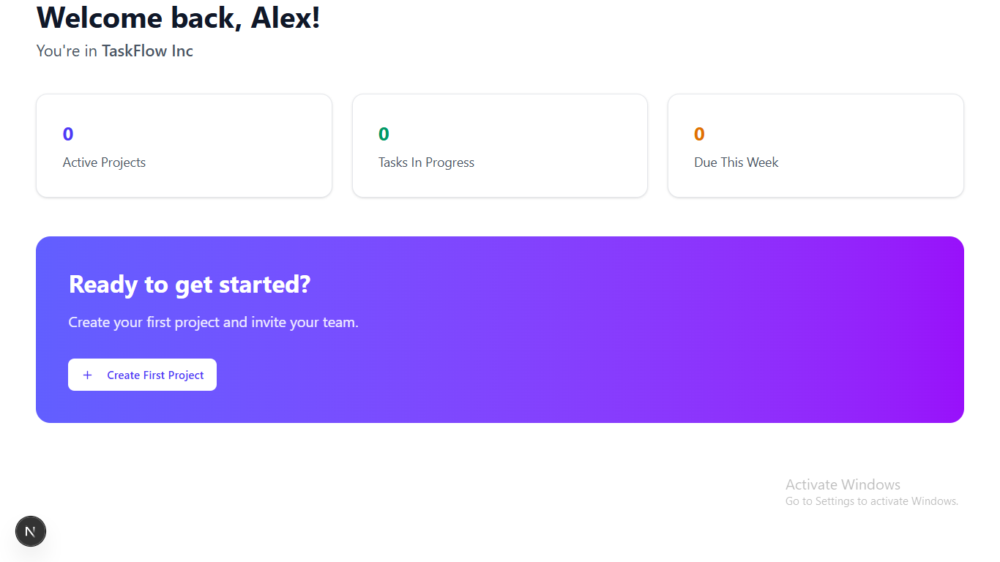
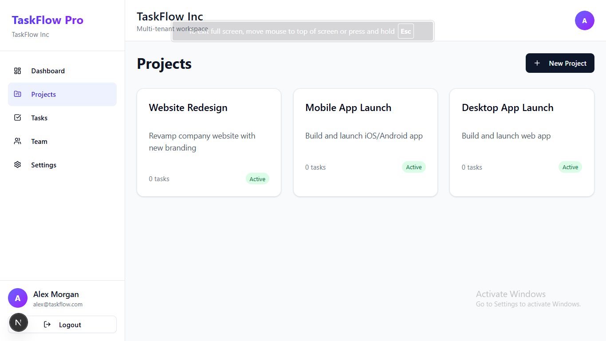
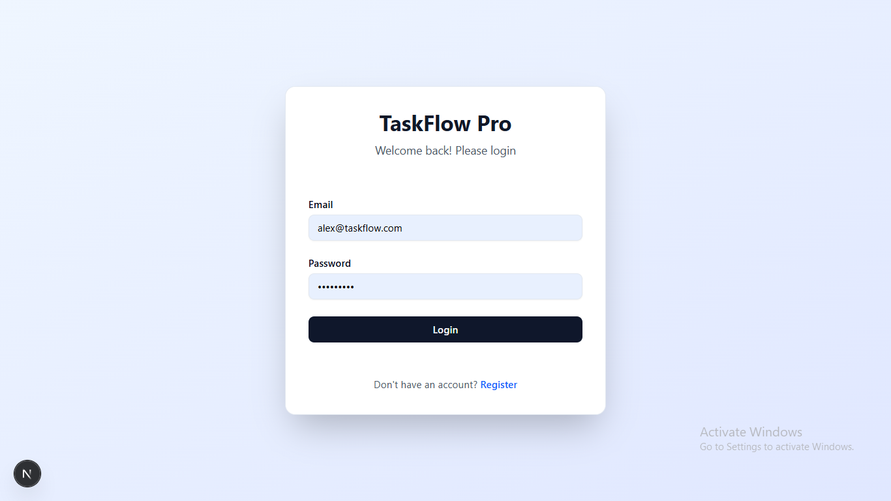
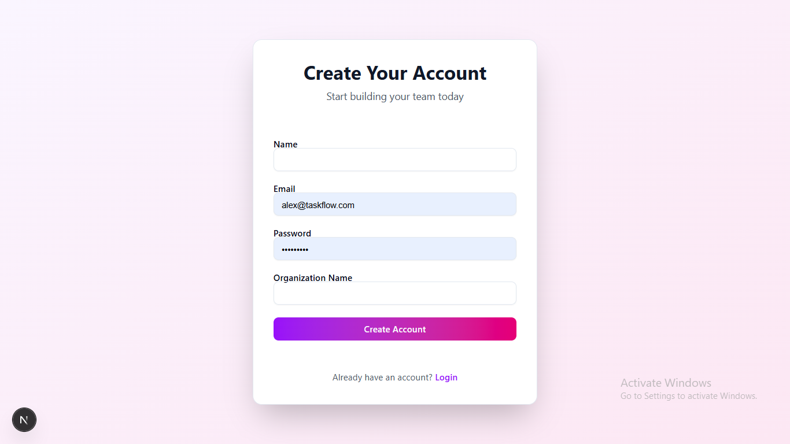
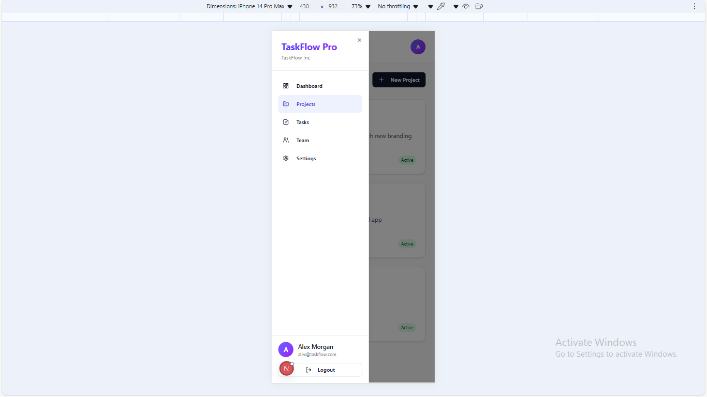

# TaskFlow Pro — Multi-Tenant Task Management SaaS

**Full-Stack MERN + Next.js 14 App Router | Production-Grade | Real Multi-Tenancy**

- **Live Demo:** [https://taskflow-pro.vercel.app](https://taskflow-pro.vercel.app) (coming after deploy)
- **Backend Repo:** [https://github.com/Sujitpandey1409/taskflow-pro](...)





## Features

- **Database-per-Organization** — True multi-tenancy
- **RBAC** (Owner / Admin / Member) with invite system
- **Secure Auth** — JWT + HttpOnly Refresh Tokens + Auto-refresh
- **Real-time Ready** — Built for Socket.io
- **Next.js 14 App Router + Tailwind + shadcn/ui + Sonner + Zustand + TanStack Query**
- **Middleware Protection** — Optimized routing logic
- **Zod Validation** — Client & server-side ready
- **Modern UI** — Geist Font + Gradient Design

## Tech Stack

| Layer | Technology |
|-------|-----------|
| Frontend | Next.js 14 (App Router), TypeScript, Tailwind, shadcn/ui, Sonner |
| State Management | Zustand + TanStack Query |
| Backend | Node.js, Express, MongoDB, Mongoose |
| Authentication | JWT + HttpOnly Cookies + Refresh Tokens |
| Multi-Tenancy | One database per organization |
| Validation | Zod |
| Deployment | Vercel (frontend), Render/Railway (backend) |

## Screenshots

<div align="center">
    
    
    
    
    
</div>

## Project Structure

```
taskflow-pro/
├── backend/          # Express + MongoDB (multi-tenant)
├── frontend/         # Next.js 14 + Tailwind + shadcn/ui
├── screenshots/      # UI previews
└── README.md         # Documentation
```

## Why This Project Stands Out

- Not a tutorial clone
- Real SaaS architecture (like ClickUp, Linear, Notion)
- Production-ready security & UX
- Beautiful, modern, responsive UI
- Fully tested API with Postman collection
- Works in 5 seconds

## Quick Start

```bash
# Backend
cd backend && npm install && npm run dev

# Frontend
cd frontend && npm install && npm run dev
```

Visit: http://localhost:3000

## Upcoming Features

- Kanban Task Board (Drag & Drop)
- Real-time Comments (Socket.io)
- File Uploads (S3 Presigned URLs)
- Dark Mode Toggle
- Mobile PWA
- Production Deployment (Vercel + Render)